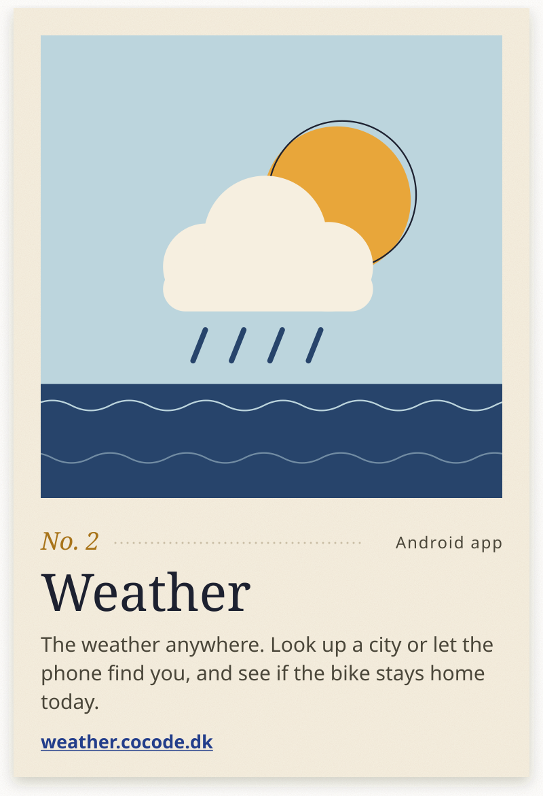
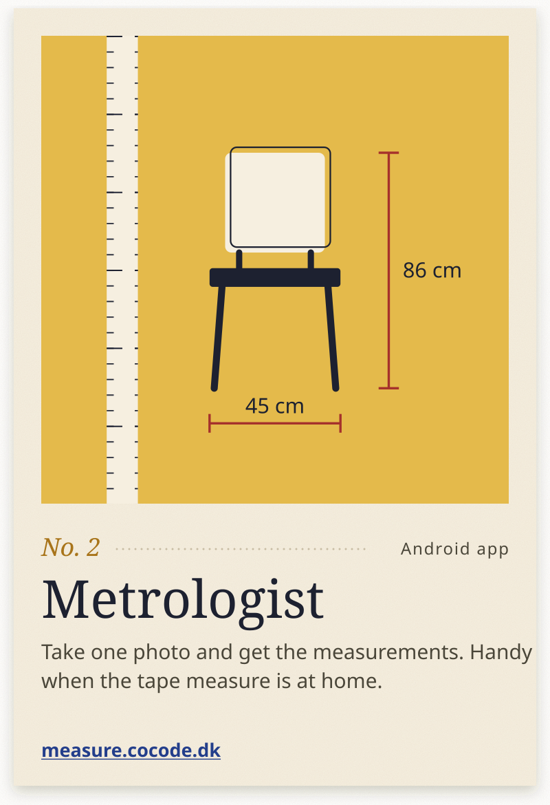
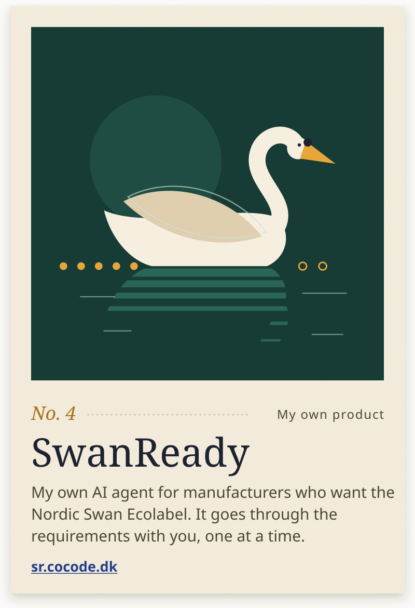
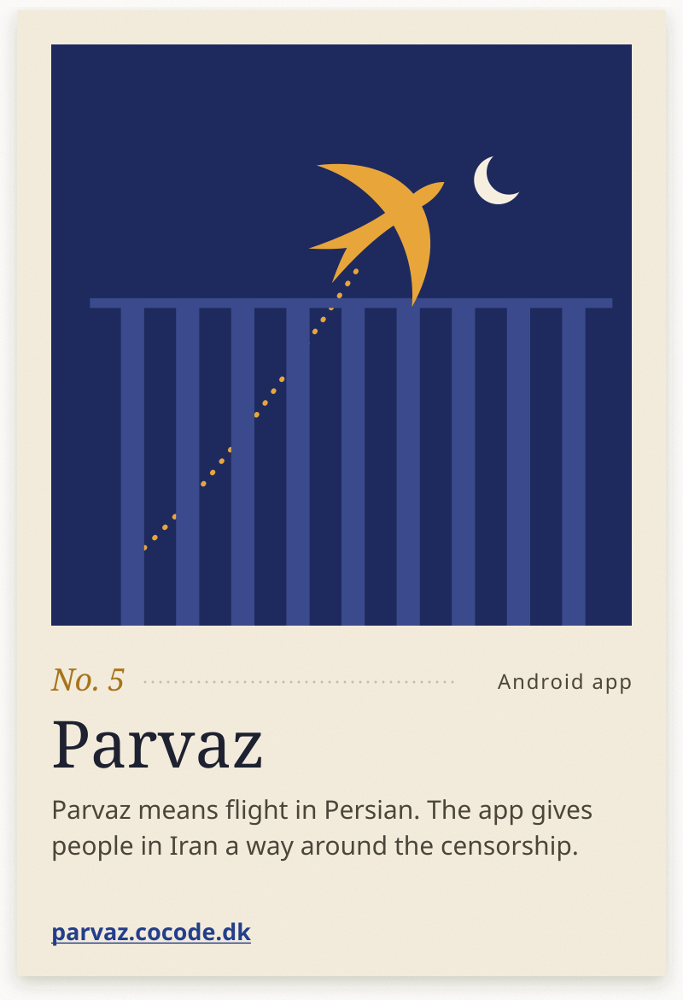
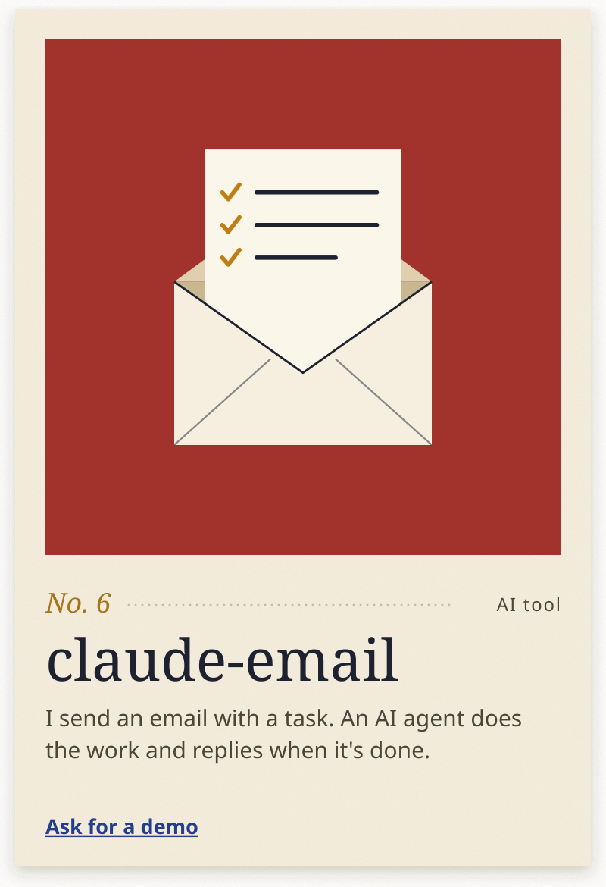
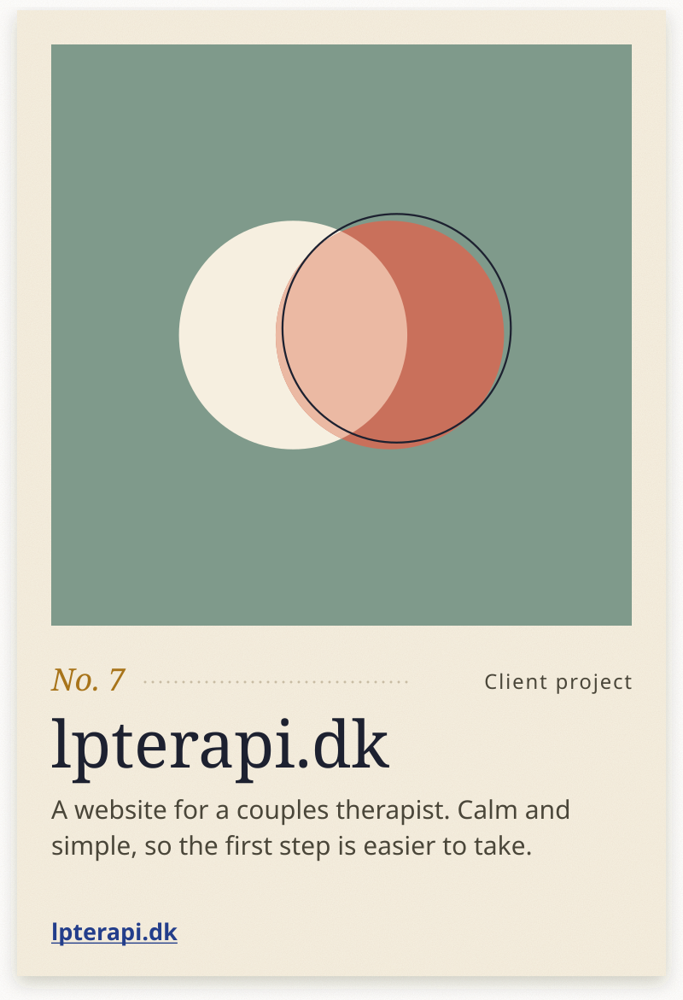
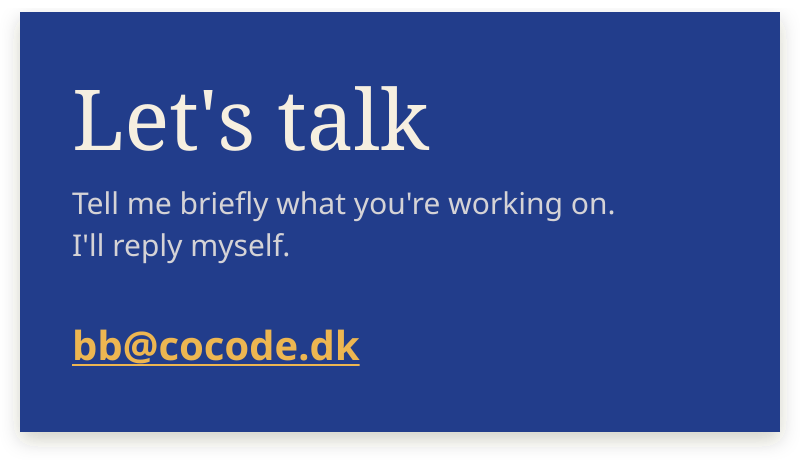

<!-- Generated by `npm run readme` from templates/partials/ and readme/copy.en.json. Edit those, not this file. -->

This is what I've made: apps, games, websites and AI tools. Have a look around, and tell me if you want something like it.

 

<h3 align="center"></h3>

<i>The things I'm most glad I made.</i>

 

<h3 align="center"></h3>

<i>Small things, fun things and a few very big ones.</i>

<b>Android apps</b> 
<a href="https://chess.cocode.dk"><b>Chess Puzzles</b></a> · Real chess puzzles, offline too. 
<a href="https://battleship.cocode.dk"><b>Battleship</b></a> · Sink the battleships, just like you remember. 
<a href="https://cast.cocode.dk"><b>BabakCast</b></a> · Fetch a video and get a summary. 
<a href="https://player.cocode.dk"><b>BabakPlayer</b></a> · The player for what BabakCast shares. 
<a href="https://qr.cocode.dk"><b>Link QR Wallet</b></a> · Your links as QR codes. 
<a href="https://lifemeter.cocode.dk"><b>LifeMeter</b></a> · Your life in numbers. 
<a href="https://calendar.cocode.dk"><b>Calendar</b></a> · A Persian calendar. 
<a href="https://tms.cocode.dk"><b>TMS Measurement</b></a> · Measuring for TMS treatment.

<b>Web and games</b> 
<a href="https://persisk.cocode.dk"><b>Danish-Persian</b></a> · Language lessons on the web. 
<a href="https://japansk.cocode.dk"><b>Danish-Japanese</b></a> · Language lessons on the web. 
<a href="https://7kasif.cocode.dk"><b>7kasif</b></a> · A card game for several players. 
<a href="https://dune.cocode.dk"><b>Dune</b></a> · A strategy game in the browser. 
<a href="https://tiefighter.cocode.dk"><b>TIE Fighter</b></a> · A 3D game in the browser. 
<a href="https://tetris.cocode.dk"><b>Tetris</b></a> · The classic block game in the browser. 
<a href="https://primes.cocode.dk"><b>Reverse Prime Plot</b></a> · Prime numbers, drawn as a pattern.

<b>Client projects</b> 
<a href="https://klinikvenus.dk"><b>Venus Høreklinik</b></a> · Hearing aids and hearing tests in central Copenhagen. 
<a href="https://nick-autoteknik.dk"><b>Nick Autoteknik</b></a> · A car repair shop in Rødovre. 
<b>Klinik for Manuel Terapi</b> · A website for a clinic. 
<b>Unity Foundation</b> · A website for a charity.

<b>For Samsung TV</b> 
<a href="https://tv-vejr.cocode.dk"><b>Copenhagen Weather</b></a> · The weather on the big screen. 
<a href="https://nightgallery.cocode.dk"><b>Night Gallery</b></a> · A gallery for the living room.

<b>AI tools</b> 
<a href="https://jev-bench.cocode.dk"><b>Jev Bench</b></a> · Measures how fast and how accurately AI models sort, and compares them. 
<a href="https://graph-loop.cocode.dk"><b>graph-loop</b></a> · AI agents that keep working without supervision. 
<a href="https://rag.cocode.dk"><b>zjm-rag</b></a> · Finds the file with the answer and answers from it. 
<b>MCP servers</b> · Give an AI access to calendars, tasks and memory. 
<a href="https://fits.dk"><b>FITS.DK</b></a> · A compliance platform. More than 3,000 hours of work.

 

<h3 align="center"></h3>

<b>Advice</b> 
Where does AI make sense for you, and where doesn't it? You get an honest answer and a plan you can use.

<b>AI agents</b> 
Agents that do real work: they read, sort, reply and follow up. Built for your day-to-day.

<b>Automation</b> 
A machine can often handle the dull work that eats your time. I find it and get it running.

 

<h3 align="center"></h3>

My trade is building software. I've done it for more than 25 years, and today most of it is about AI: I advise on it, and I build with it.

Much of what you see here was made with the same AI tools I recommend to my clients. So I know what works in practice, and what only looks good in a slide deck.

You always talk to me. Not to a salesperson.

<i>Babak</i> 
Copenhagen · Danish, English and Persian

 

<a href="https://cocode.dk">cocode.dk</a> · <a href="https://linkedin.com/in/babakbandpey">LinkedIn</a> · +45 53 73 75 14

